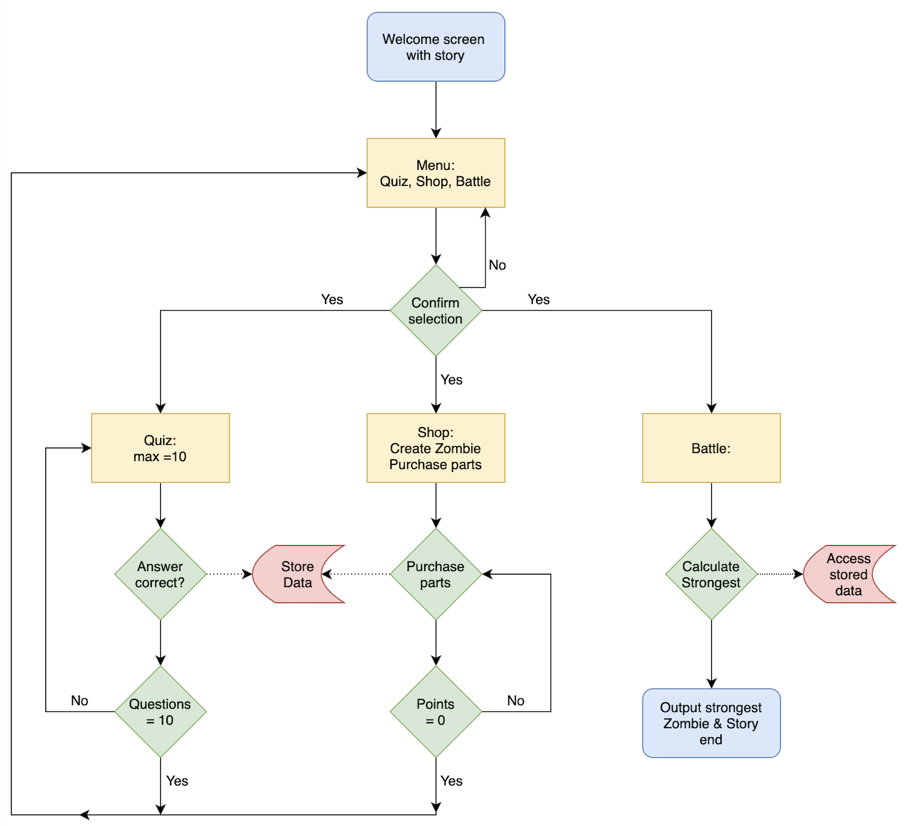
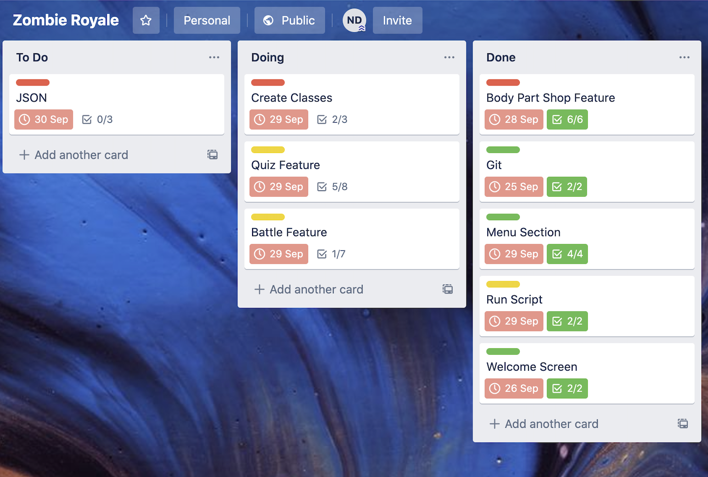

# Zombie Royale

## GitHub Repository: https://github.com/njdeane/ZombieRoyale

## Software Development Plan:
### Purpose & Scope
The movies and TV shows were right, the Zombie Apocalypse has happened. Several years ago the COVID-19 virus mutated and became what is now commonly known as the Zombie Virus. The problem that presents itself to the remaining survivors is that there is a limited number of vaccines available. Most government ifrastructure including the laboratory that created the vaccine has been destroyed and the scientists involved in the production of the vaccine have all perished. 
 
 
*Zombie Royale* has been created by the remnants of the government as a means to distribute the zombie vaccine to the populace. The government has identified that in the current state of the world only the strong should recieve the vaccine and the weak shall perish. Only those contestants with complete knowledge and mastery over zombies will survive in the current state of the world. The contestants that prove themselves worthy will recieve the zombie vacine so they may walk the earth immune to the virus. With this philosophy the government hopes the human race will eventually prevail. A contestant that wishes to recieve the vaccine must enter *Zombie Royale* 
 
 
Stage 1: 
 
a contestant is vetted through a series of questions to test their knowledge in all things zombie as zombies are enemey number 1. Only those truely skilled in zombie lore will excell at this stage. Contestants accrue points for each correctly answered question. At the end of stage 1 a contestant will have an accrued score that they may use in the next stage of *Zombie Royale*
 
 
Stage 2:
 
In this stage the contestants recieve a zombie that they will later battle for access to the vacine. But first contestants will spend their points at the *Body Part Shop*. This is where a contestant will purchase body parts to feed their zombie to make them strong. The more points a contestant has the more body parts they may purchase. Different body parts have different effects on a zombies strength so spend your points wisely.
 
 
Stage 3:
 
The final stage is the stage that inspired the title.. enter *Battle Royale*.Here contestants battle their zombies for the prized vaccine... Only the strong survive.The outcome of the battle is heavily determined on how well a contestant has done in Stages 1 & 2. The victor of *Battle Royale* will recieve a vaccine that provides immunity to the zombie virus. 
 
 
### Features
Zombie Quiz:
 
This feature is a quiz about all things zombie. With each correct question, contestants will accrue points. The quiz will be a loop that exits once maximum number of questions has been reached. Points will be saved in a hash variable that has contestant name as key and contestant points as value. The points value will be updated throughout each iteration of the quiz. The control flow for each question will be conditional with the outcome affecting the contestants points acrual. The points variable will be stored in an external JSON file for each contestant to enable access at later stages and with multiple contestants. Error handling will be a simple rescue statement redirecting the contestant to answer the question in the required format. 
 
 
Body Part Shop:
 
This feature is where a contestant spends their points to purchase body parts to feed and grow the strength of their zombies. This feature will be set up as a loop. First the contestant will be prompted to name their zombie which will create a zombie variable with an associated strength value. As the contestant purchases body parts their associated points will decrease and the zombies strength value will increase. The Body Part Shop will be a Class with a hash containing body part data and methods enabling the spending of points and creation of a contestants zombie with associated name and strength value. Once a contestants points reach zero the contestants zombie will be stored in a JSON file ready for calling later in the battle stage. Error handling will be executed to catch any invalid input and redirected towards valid input.
 
 
Battle Royale:
 
This feature is the final feature of the game. Once multiple contestants have completed the previous two features it is time to "battle" the zombies. Currently due to time contstraints this feature will be set up as a condtional loop that pulls the JSON files for each contestant and iterates through the data with the output being the zombie with the most "strength" points. This feature will be expanded upon in subsequent versions of *Zombie Royale* to enable turn by turn battle.
 
 
### User Interaction Outline
Instructions for interaction with *Zombie Royale* will be provided at the beginning of each stage. First when a contestant runs the game there will be an introduction explaining the outline of the game and setting of the story. Beneath this will be instruction on how to enter the *Zombie Quiz*  
Upon entering *Zombie Quiz* the user will be instructed to enter their contestant name. Following this the first quiz question will be displayed. The quiz will be multiple choice format with error handling rescues for invalid input. Each question answered will display the current points accrued and the next question. Upon completion of the quiz the user will be redirected to the *Body Part Shop* 
 
 
Here the user will be greeted with instructions on how the *Body Part Shop* works and how to proceed. The user will be prompted to name their zombie, an error handling rescue will be inplace to catch and redirect invalid input. A points tally will also be displayed to the user. Each user will select the desired body parts and with each iteration of the loop the users points will be updated. A zombie strength level will also be displayed and updated with each iteration. Upon points reaching 0 the loop will break and the user will be prompted to exit the game to allow another contestant to go through the previous processes. Or prompted to the *Battle Royale* feature if more than one user has completed the previous steps. 
 
 
Following execution of the previous features by multiple contestants the user may enter the *Battle Royal* feature. With the first release of *Zombie Royale* this feature will output the winning zombie to the screen and the final parts of the story will be displayed. However in subsequent versions of the game this feature will be expanded upon to enable more interactive turn by turn gameplay.

## Control Flow Diagram:

## Implementation Plan: Trello link (public board): https://trello.com/b/vDNtREqs/zombie-royale

## Help Documentation:

To install Zombie Royale first navigate to the Zombie Royale GitHub Repository listed at the top of this README document, you may do this with the your internet browser of your choice.
 
 
Next you will need to "clone" Zombie Royale to your computer: 
To do this use the search function of your computer and search for "Terminal" click on the result that pops up. A terminal will now launch on your computer. 
 
To "clone" the Zombie Royale repository to your computer type the following into the terminal application: 
git clone git@github.com:njdeane/ZombieRoyale.git 
Then press enter on your keyboard.
 
 
The next step is to launch the game via typing into the terminal the following: 
run_zombieroyale.sh
 
 
Following successful launch of the game you will be greated and prompted to enter your name and begin playing. The game flow is as follows: 
First enter the Quiz, followed by the Body Part Shop and finally entering Zombie Royale. There is also an instructional help menu if you require further instructions whilst playing the game, this help menu is accessed via the main screen of the game as option "d".

## Troubleshooting:
If the game does not launch you may requre the Ruby Gems the game utilizes: 
Again in the terminal type the following commands to install the Ruby Gems on your computer: 
gem install tty-colorize  (then press enter) 
gem install tty-font  (then press enter) 
gem install tty-box  (then press enter) 
gem install tty-link  (then press enter) 
 
Now try run the program again by typing the following and then pressing enter: 
run_zombieroyale.sh
 
 
## Disclaimer
Zombie Royale was created in the Ruby programming language on an Apple Mac computer runnung OSX operating system version 10.15.7 
Zombie Royale has not been tested accross multiple operating systems and can therefor not guarantee operation on all platforms. 
 
Zombie Royale is an incomplete game that will be finished in February 2021. It will feature the multiplayer functionality so multiple people can play and contend in the final and most exciting feature of the game which is the battle known as Zombie Royale. 
More quiz questions, a redesigned menu and redisigned game navigation interface will also be implemented. Thank you for your patience. 
 
HAPPY ZOMBIE APOCALYPSE DEAR READER

